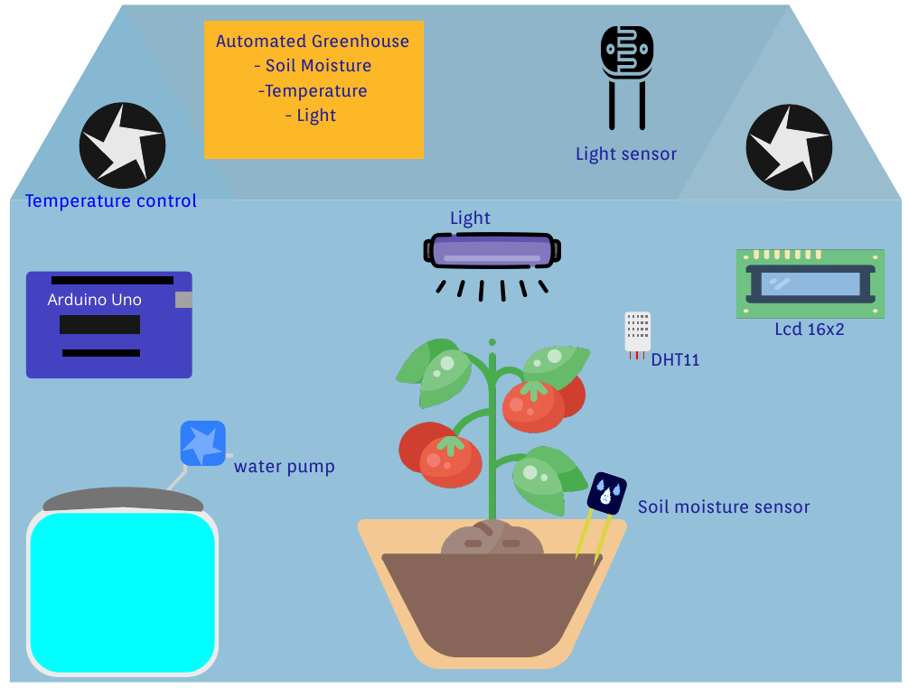
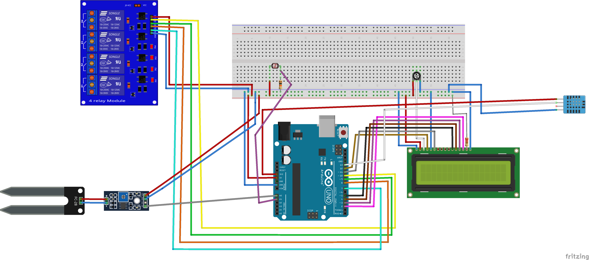

# Arduino Greenhouse Automation System

This project is available at: [Arduino ProjectHub](https://projecthub.arduino.cc/djomaro/greenhouse-automation-63a3ac)

---

## Requirements:

Before starting, ensure you have the necessary tools:

1. **Grove - 4-Channel SPDT Relay Module**
2. **LDR** (Light Dependent Resistor), 5 MΩ
3. **220 ohm Resistor**
4. **DHT11** Temperature & Humidity Sensor (3 pins)
5. **Solderless Breadboard** (Full Size)
6. **16x2 Alphanumeric LCD**
7. **SparkFun Soil Moisture Sensor** (with Screw Terminals)
8. **Arduino UNO**
9. **Jumper Wires** (generic)
10. **10k ohm Resistor**
11. **10k ohm Trimmer Potentiometer**

---

## Apps and Platforms:

- **Arduino IDE**

---

## Project Description:

The **Arduino Greenhouse Automation System** is a project aimed at automating key environmental factors in a greenhouse, such as temperature, humidity, light, and soil moisture. By integrating various sensors (DHT11, soil moisture sensor, and LDR), and controlling different systems like watering, heating, cooling, and lighting using relays, this system can help maintain optimal conditions for plant growth.

This project uses an **Arduino UNO** microcontroller to process the data from the sensors and activate relays based on predefined conditions, such as:
- Watering the plants when the soil moisture level is low.
- Activating the heating system when the temperature is too low.
- Turning on the cooling system when the temperature is too high.
- Controlling the lighting based on light intensity detected by the LDR.

The system also provides real-time feedback on temperature, humidity, and moisture levels through an **LCD screen**.

---

## Circuit Connections Design:

Below is a description of how the various components are connected to the **Arduino UNO**:

1. **DHT11 Sensor**:
   - Pin 1 (VCC) to 5V on Arduino.
   - Pin 2 (Data) to digital pin 13.
   - Pin 3 (GND) to GND on Arduino.

2. **Soil Moisture Sensor**:
   - **VCC** to 5V on Arduino.
   - **GND** to GND on Arduino.
   - **Analog Output (A0)** to analog pin A0 on Arduino.

3. **LDR (Light Dependent Resistor)**:
   - One pin of the LDR connected to 5V.
   - The other pin of the LDR connected to analog pin A1 on Arduino.

4. **Relay Module**:
   - **Relay 1** (Water Pump Control): Pin 7.
   - **Relay 2** (Heating System Control): Pin 8.
   - **Relay 3** (Cooling System Control): Pin 9.
   - **Relay 4** (Lighting System Control): Pin 10.

5. **LCD Display** (16x2):
   - **RS** to pin 12.
   - **EN** to pin 11.
   - **D4** to pin 5.
   - **D5** to pin 4.
   - **D6** to pin 3.
   - **D7** to pin 2.
   - **VSS** to GND.
   - **VCC** to 5V.
   - **VO** to the wiper of the **10k potentiometer**.
   - **RW** to GND.

---
---
## Arduino Code

The Arduino code for this project can be found in the [arduino.ino](./arduino.ino) file.
---
## Future Improvements:

1. **Remote Monitoring**: Add Wi-Fi or Bluetooth functionality for remote monitoring and control of the greenhouse.
2. **More Sensors**: Integrate additional sensors, such as CO2 or pH sensors, for more advanced control.
3. **Automated Alerts**: Implement SMS or email alerts to notify users of critical changes in the environment.
4. **Data Logging**: Store sensor data to analyze patterns over time and optimize the greenhouse environment further.

---

Feel free to modify or extend this project according to your needs for a more complete greenhouse automation solution!
